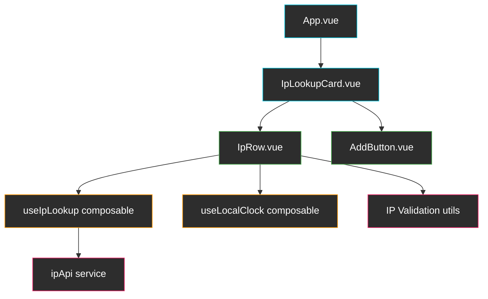

# Torq.io Frontend Home Assignment — Implementation Plan

## Assignment Summary

Build a web application that **translates IP addresses into countries**. Users can add multiple rows, enter IPs, and see the resolved country (with flag) and a **real-time local clock** for each result.

### Mock Reference

````carousel

<!-- slide -->

<!-- slide -->

<!-- slide -->

````

---

## Technology Choices

| Concern | Choice | Rationale |
|---|---|---|
| Framework | **Vue 3** (Composition API + `<script setup>`) | Explicitly preferred by Torq |
| Language | **TypeScript** | Explicitly preferred by Torq |
| Build tool | **Vite** | Official Vue recommendation, fastest DX |
| State | **Reactive refs** (local component state) | App is small; no need for Pinia |
| Styling | **Vanilla CSS** (scoped `<style>`) | Clean, no extra deps, matches mock simplicity |
| API | **ip-api.com** (`http://ip-api.com/json/{ip}`) | Free, no API key, returns `country`, `countryCode`, `timezone` |
| Testing | **Vitest + Vue Test Utils** | Native Vite integration |
| CI/CD | **GitHub Actions** | Standard, free for public repos |

---

## User Review Required

> [!IMPORTANT]
> **Vue 3 vs React**: The assignment says *"you are free to use whatever you like"* but explicitly states *"TypeScript and Vue.js 3 will be an advantage."* This plan uses **Vue 3 + TypeScript**. Let me know if you'd prefer React instead.

> [!WARNING]
> **ip-api.com uses HTTP only** (no HTTPS on the free tier). This is fine for a home assignment but would not be acceptable in production. The app will need to be served over HTTP during dev, or we can use a CORS proxy / the batch endpoint. We'll handle this with a simple composable that wraps `fetch`.

> [!NOTE]
> **Rate limit**: ip-api.com allows 45 requests/minute. For the scope of this assignment that's more than enough. We'll still implement rate-limit awareness by reading the `X-Rl` / `X-Ttl` headers.

---

## Architecture Overview



### Component Hierarchy

| Component | Responsibility |
|---|---|
| `App.vue` | Root — mounts the card |
| `IpLookupCard.vue` | Card container with header ("IP Lookup"), subtitle, "✕" close button, "+ Add" button, and list of rows |
| `IpRow.vue` | Single row: row number badge, text input, spinner/flag/error indicator, real-time clock |
| `AddButton.vue` | Simple styled "+ Add" button |

### Composables

| Composable | Responsibility |
|---|---|
| `useIpLookup` | Manages the lookup lifecycle for a single row: `lookup(ip)`, returns reactive `{ loading, result, error }` |
| `useLocalClock` | Given an IANA timezone string, returns a reactive `time` ref that ticks every second (`hh:mm:ss`) |

### Services & Utils

| File | Responsibility |
|---|---|
| `services/ipApi.ts` | Thin wrapper around `fetch('http://ip-api.com/json/{ip}')` with typed response |
| `utils/validateIp.ts` | IPv4 (+ optionally IPv6) regex validation |
| `types/index.ts` | Shared TypeScript interfaces (`IpLookupResult`, `IpRowState`, etc.) |

---

## Proposed Changes

### Project Scaffolding

#### [NEW] Project root (Vite + Vue 3 + TypeScript)

Scaffold with:

```bash
npx -y create-vite@latest ./ --template vue-ts
```

Then install test deps:

```bash
npm install -D vitest @vue/test-utils jsdom
```

Final project structure:

```
torq/
├── src/
│   ├── App.vue
│   ├── main.ts
│   ├── components/
│   │   ├── IpLookupCard.vue
│   │   ├── IpRow.vue
│   │   └── AddButton.vue
│   ├── composables/
│   │   ├── useIpLookup.ts
│   │   └── useLocalClock.ts
│   ├── services/
│   │   └── ipApi.ts
│   ├── utils/
│   │   └── validateIp.ts
│   ├── types/
│   │   └── index.ts
│   └── assets/
│       └── main.css
├── tests/
│   ├── components/
│   │   ├── IpLookupCard.spec.ts
│   │   └── IpRow.spec.ts
│   ├── composables/
│   │   ├── useIpLookup.spec.ts
│   │   └── useLocalClock.spec.ts
│   ├── services/
│   │   └── ipApi.spec.ts
│   └── utils/
│       └── validateIp.spec.ts
├── .github/
│   └── workflows/
│       └── ci.yml
├── vitest.config.ts
├── tsconfig.json
├── package.json
└── README.md
```

---

### Types

#### [NEW] [index.ts](file:///home/idan/workspaces/gemini/torq/src/types/index.ts)

- `IpApiResponse` — typed shape of ip-api.com JSON response (`status`, `country`, `countryCode`, `timezone`, `query`, `message`)
- `IpRowState` — per-row reactive state (`id`, `ip`, `loading`, `result`, `error`, `isValid`)
- `LookupStatus` — union type `'idle' | 'loading' | 'success' | 'error'`

---

### Services

#### [NEW] [ipApi.ts](file:///home/idan/workspaces/gemini/torq/src/services/ipApi.ts)

```typescript
export async function lookupIp(ip: string): Promise<IpApiResponse> {
  const res = await fetch(
    `http://ip-api.com/json/${ip}?fields=status,message,country,countryCode,timezone,query`
  );
  if (!res.ok) throw new Error(`HTTP ${res.status}`);
  const data: IpApiResponse = await res.json();
  if (data.status === 'fail') throw new Error(data.message ?? 'Unknown error');
  return data;
}
```

Key behaviors:
- Reads `X-Rl` header to warn if approaching rate limit
- Throws on HTTP errors and API-level `status: 'fail'`
- Returns strongly typed `IpApiResponse`

---

### Utils

#### [NEW] [validateIp.ts](file:///home/idan/workspaces/gemini/torq/src/utils/validateIp.ts)

```typescript
const IPV4_REGEX = /^((25[0-5]|(2[0-4]|1?\d)?\d)\.){3}(25[0-5]|(2[0-4]|1?\d)?\d)$/;

export function isValidIpv4(ip: string): boolean {
  return IPV4_REGEX.test(ip.trim());
}
```

- Validates IPv4 format (each octet 0-255)
- Optionally add IPv6 support

---

### Composables

#### [NEW] [useIpLookup.ts](file:///home/idan/workspaces/gemini/torq/src/composables/useIpLookup.ts)

Reactive composable that wraps the API call:

```typescript
export function useIpLookup() {
  const loading = ref(false);
  const result = ref<IpApiResponse | null>(null);
  const error = ref<string | null>(null);

  async function lookup(ip: string) {
    loading.value = true;
    error.value = null;
    try {
      result.value = await lookupIp(ip);
    } catch (e) {
      error.value = (e as Error).message;
    } finally {
      loading.value = false;
    }
  }

  return { loading, result, error, lookup };
}
```

#### [NEW] [useLocalClock.ts](file:///home/idan/workspaces/gemini/torq/src/composables/useLocalClock.ts)

Real-time ticking clock for a given timezone:

```typescript
export function useLocalClock(timezone: Ref<string | null>) {
  const time = ref('');
  let intervalId: number | null = null;

  function tick() {
    if (!timezone.value) { time.value = ''; return; }
    time.value = new Date().toLocaleTimeString('en-GB', {
      timeZone: timezone.value,
      hour: '2-digit', minute: '2-digit', second: '2-digit',
    });
  }

  watch(timezone, (tz) => {
    if (intervalId) clearInterval(intervalId);
    if (tz) {
      tick();
      intervalId = window.setInterval(tick, 1000);
    }
  }, { immediate: true });

  onUnmounted(() => { if (intervalId) clearInterval(intervalId); });

  return { time };
}
```

---

### Components

#### [NEW] [App.vue](file:///home/idan/workspaces/gemini/torq/src/App.vue)

- Minimal root: centers the `IpLookupCard` on screen
- Sets global font (Inter from Google Fonts) and a subtle background

#### [NEW] [IpLookupCard.vue](file:///home/idan/workspaces/gemini/torq/src/components/IpLookupCard.vue)

**Template structure:**
```
┌──────────────────────────────────┐
│  IP Lookup                    ✕  │  ← header
├──────────────────────────────────┤
│  Enter one or more IP addresses  │  ← subtitle
│  and get their country           │
│                                  │
│  [+ Add]                         │  ← AddButton
│ ─────────────────────────────── │  ← divider
│  ① [___________] 🔄              │  ← IpRow (repeated)
│  ② [___________] 🇺🇸 14:25:03    │
│  ③ [___________] ❌ Invalid IP   │
└──────────────────────────────────┘
```

**Reactive state:**
- `rows: Ref<IpRowState[]>` — array of row states
- `addRow()` — pushes a new row with a unique id
- `removeRow(id)` — removes a row (optional, not in mocks but good UX)

**Behavior:**
- Starts with one empty row on mount
- "+ Add" appends a new row

#### [NEW] [IpRow.vue](file:///home/idan/workspaces/gemini/torq/src/components/IpRow.vue)

**Props:** `rowNumber`, `modelValue` (the IP string)  
**Emits:** `update:modelValue`

**Behavior per phase:**

| Phase | Behavior |
|---|---|
| **Phase 1** | Row number badge + text input. On `@blur` → trigger lookup |
| **Phase 2** | Disable input while loading. Show **spinner** during search. Validate IP client-side before calling API. Show **validation error** inline if invalid. |
| **Phase 3** | After result: re-enable input, show **country flag** (emoji from `countryCode`) + **real-time clock** (`hh:mm:ss`). User can edit and re-search. |

**Country flag:** Convert `countryCode` (e.g. `"US"`) to flag emoji using regional indicator symbols:

```typescript
function countryCodeToFlag(code: string): string {
  return [...code.toUpperCase()]
    .map(c => String.fromCodePoint(0x1F1E6 - 65 + c.charCodeAt(0)))
    .join('');
}
```

#### [NEW] [AddButton.vue](file:///home/idan/workspaces/gemini/torq/src/components/AddButton.vue)

- Simple `<button>` with a "+ Add" label
- Light blue background matching the mock (`#4FC3F7` / similar)

---

### Styling

#### [NEW] [main.css](file:///home/idan/workspaces/gemini/torq/src/assets/main.css)

Design tokens inspired by the mocks:

| Token | Value | Usage |
|---|---|---|
| `--color-primary` | `#4FC3F7` | Add button background |
| `--color-text` | `#333` | Main text |
| `--color-text-secondary` | `#888` | Subtitle, hints |
| `--color-border` | `#e0e0e0` | Card border, input border |
| `--color-bg` | `#f5f5f5` | Page background |
| `--color-card` | `#ffffff` | Card surface |
| `--radius-card` | `12px` | Card border radius |
| `--radius-input` | `4px` | Input border radius |
| `--font-family` | `'Inter', sans-serif` | Global font |

Key UI details from the mocks:
- Card has a subtle **rounded border** and **drop shadow**
- Row numbers use a **circular gray badge**
- Input field has a **blue outline on focus**
- Loading spinner is a small **dotted circle animation**
- Error messages displayed in **red text** below the input
- Close button (✕) is top-right of the card

---

### Testing (Bonus)

#### [NEW] Test files

| Test file | What it covers |
|---|---|
| `validateIp.spec.ts` | Valid IPs, invalid IPs, edge cases (empty, spaces, IPv6) |
| `ipApi.spec.ts` | Mock `fetch` — success, fail response, network error |
| `useIpLookup.spec.ts` | Loading state transitions, error handling |
| `useLocalClock.spec.ts` | Clock ticks, timezone changes, cleanup |
| `IpRow.spec.ts` | Renders input, blur triggers lookup, shows spinner, shows result |
| `IpLookupCard.spec.ts` | Add button adds rows, initial row present |

---

### CI/CD (Bonus)

#### [NEW] [ci.yml](file:///home/idan/workspaces/gemini/torq/.github/workflows/ci.yml)

```yaml
name: CI
on: [push, pull_request]
jobs:
  test:
    runs-on: ubuntu-latest
    steps:
      - uses: actions/checkout@v4
      - uses: actions/setup-node@v4
        with: { node-version: 20 }
      - run: npm ci
      - run: npm run lint
      - run: npm run test -- --run
      - run: npm run build
```

---

## Implementation Order


| Step | Details | Est. effort |
|---|---|---|
| **1. Scaffold** | `create-vite` + install deps + configure Vitest | 5 min |
| **2. Types & Utils** | TypeScript interfaces + IP validation | 10 min |
| **3. API Service** | `ipApi.ts` with fetch wrapper | 10 min |
| **4. Composables** | `useIpLookup` + `useLocalClock` | 15 min |
| **5. Components** | `App`, `IpLookupCard`, `IpRow`, `AddButton` + all CSS | 30 min |
| **6. Tests** | Unit tests for all layers | 20 min |
| **7. CI/CD** | GitHub Actions workflow | 5 min |
| **8. Polish** | README, cleanup, final visual QA | 10 min |

---

## Verification Plan

### Automated Tests

```bash
npm run test -- --run       # All Vitest unit tests
npm run build               # TypeScript compilation check
```

### Manual / Browser Verification

1. Run `npm run dev` and open in browser
2. Verify "+ Add" creates new rows
3. Enter a valid IP (e.g. `8.8.8.8`) → blur → see spinner → see 🇺🇸 United States + ticking clock
4. Enter an invalid IP (e.g. `999.999.999.999`) → blur → see validation error
5. Enter a private IP (e.g. `192.168.1.1`) → blur → see API error handled gracefully
6. Add multiple rows and search simultaneously
7. Edit a resolved IP and re-search
8. Verify the clock ticks in real-time and respects the timezone
9. Visual comparison against the provided mocks
